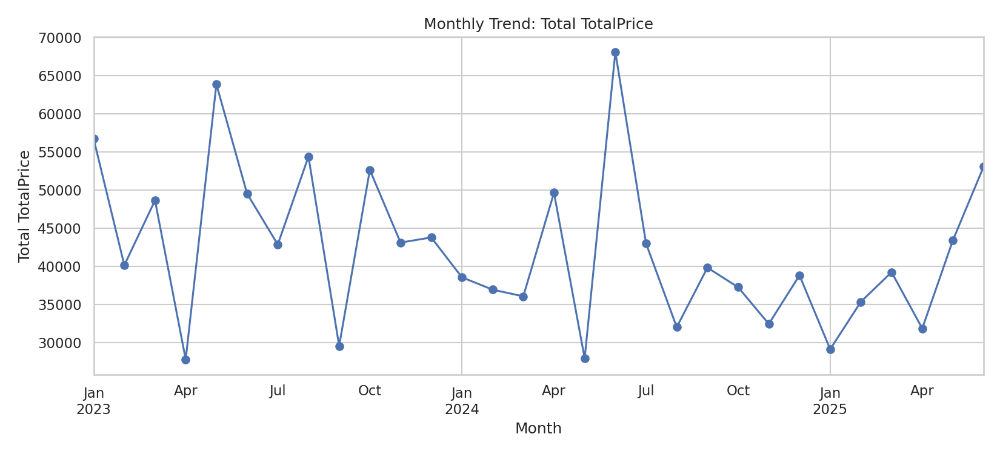
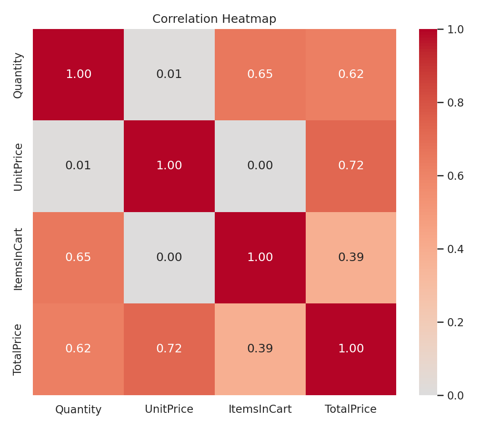
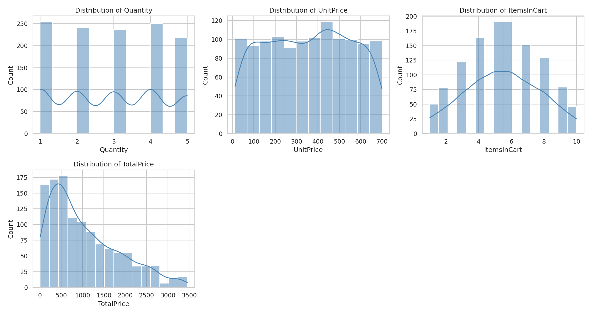

# Project 2: Exploratory Data Analysis (EDA)

## Goal
Analyze a dataset to understand patterns, trends, and distributions.

## Key Requirements Covered
- **Basic statistics** — mean, median, count, std, min, max for every numeric column
- **Trends & outliers** — monthly trend of order value over time, plus IQR-based outlier detection for each numeric column
- **Key observations** — an auto-generated, plain-English summary of the most important findings

## Dataset
`Dataset_for_Data_Analytics.xlsx` — 1,200 e-commerce order records with 14 columns:

| Column | Description |
|---|---|
| OrderID | Unique order identifier |
| Date | Order date |
| CustomerID | Customer identifier |
| Product | Product purchased (Printer, Tablet, Chair, Laptop, Desk, ...) |
| Quantity | Units ordered |
| UnitPrice | Price per unit |
| ShippingAddress | Delivery address |
| PaymentMethod | Online, Cash, Credit Card, Debit Card, Gift Card |
| OrderStatus | Cancelled, Returned, Pending, Shipped, Delivered |
| TrackingNumber | Shipment tracking ID |
| ItemsInCart | Number of items in the cart at checkout |
| CouponCode | Discount code applied (if any) |
| ReferralSource | How the customer found the store |
| TotalPrice | Total order value |

## Repository Structure
```
eda_analysis.py                     # Main analysis script
README.md                           # This file
Dataset_for_Data_Analytics.xlsx     # Input dataset (place alongside the script, or pass --file)
.gitignore                          # Excludes generated eda_output/ folder
sample_output/                      # A few pre-generated charts, committed for quick preview
    trend_monthly.png
    correlation_heatmap.png
    histograms.png
```

> **Note:** Running the script creates a new `eda_output/` folder containing the full report (`eda_report.txt`) and all charts. That folder is regenerated every run, so it's excluded via `.gitignore` and not tracked in the repo. The `sample_output/` folder above holds a few static examples just so the charts are visible on GitHub without having to run anything.

## Requirements
```bash
pip install pandas numpy matplotlib seaborn openpyxl
```

## How to Run
```bash
python eda_analysis.py --file "Dataset_for_Data_Analytics.xlsx" --outdir "eda_output"
```

- `--file`   Path to the dataset (`.xlsx`, `.xls`, or `.csv`). Defaults to `Dataset_for_Data_Analytics.xlsx` in the current folder.
- `--outdir` Folder where the report and charts are saved. Defaults to `eda_output/`.

## What the Script Does

1. **Loads the data** and auto-detects numeric, categorical, and date columns.
2. **Basic statistics** — count, mean, median, std, min, max for each numeric column.
3. **Categorical summary** — unique value counts and top categories for each categorical column (skips ID-like columns with too many unique values).
4. **Missing values** — count and percentage of missing data per column.
5. **Outlier detection** — uses the IQR (Interquartile Range) method: any value below `Q1 - 1.5*IQR` or above `Q3 + 1.5*IQR` is flagged as an outlier.
6. **Trend analysis** — aggregates order value by month and reports whether the overall trend is increasing or decreasing.
7. **Correlation analysis** — Pearson correlation matrix between numeric columns, with a heatmap.
8. **Visualizations** — saved as PNG files:
   - `histograms.png` — distribution of each numeric column
   - `boxplots.png` — visual outlier check for each numeric column
   - `categorical_bar_charts.png` — top categories for each categorical column
   - `trend_monthly.png` — order value trend over time
   - `correlation_heatmap.png` — correlation between numeric variables
9. **Key observations** — an auto-generated plain-English list of findings (skew direction, outlier counts, most common categories, etc.)

## Output
Everything is written to the `--outdir` folder:
- `eda_report.txt` — full text report of all statistics and observations
- `histograms.png`, `boxplots.png`, `categorical_bar_charts.png`, `trend_monthly.png`, `correlation_heatmap.png`

## Sample Output Preview

**Monthly order value trend**


**Correlation between numeric variables**


**Distribution of numeric columns**


## Sample Key Findings (from the provided dataset)
- Dataset: 1,200 orders across 14 columns, no missing values except `CouponCode` (25.75% missing — i.e., no coupon applied).
- `TotalPrice` is right-skewed (mean 1,053.97 vs. median 823.62), with a small number (0.7%) of high-value outlier orders.
- `Quantity`, `UnitPrice`, and `ItemsInCart` are roughly symmetric with no IQR outliers.
- `TotalPrice` correlates most strongly with `UnitPrice` (0.72) and `Quantity` (0.62).
- `Printer` is the most-ordered product (15.1%); `Online` is the top payment method (21.5%); `Cancelled` is the most common order status (20.8%).
- Monthly order value shows a slight overall decline (~-4%) from the first half of the observed period to the second half, with seasonal ups and downs rather than a steady trend.

## Sample Output
A few charts generated by the script (full set is produced fresh each run in `eda_output/`, which is not checked into this repo):

**Monthly trend of order value**


**Correlation heatmap**


**Distribution histograms**


## Skills Demonstrated
Data analysis, descriptive statistics, analytical thinking, data visualization, Python scripting (pandas, numpy, matplotlib, seaborn).
